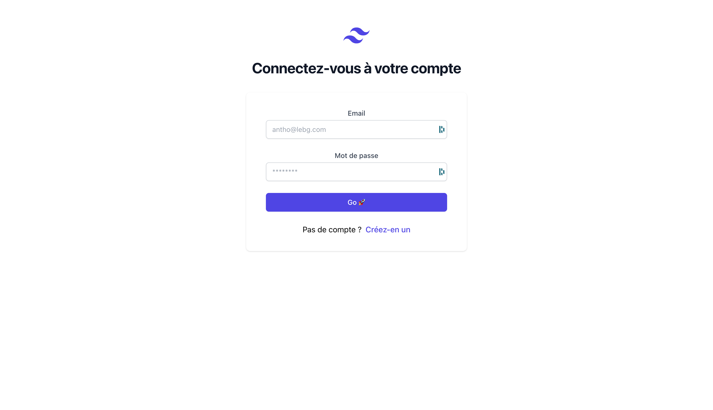
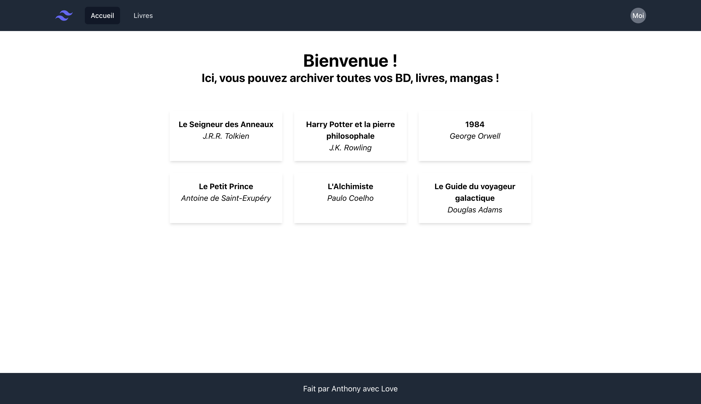
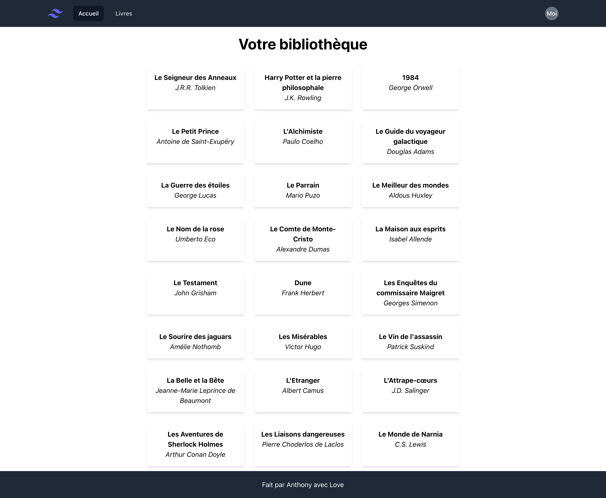

# TP Full Auth

## Description

Lors de ce TP, nous allons faire la partie authentification d'un site web.

Nous allons nous occuper de la partie backend, puis ensuite nous allons nous interesser à la partie frontend.

## Prérequis

Il est important, avant de commencer ce TP, de bien comprendre les notions suivantes :

-   De connaitre l'architecture MVC
-   MySQL
-   bcrypt / argon2
-   JWT

Ensuite :

```bash
# A la racine du projet
npm run setup

# Pour lancer le projet
npm run dev
```

## 🖥️ Frontend

Bon, vous n'allez pas faire le frontend tout seul, vous allez avoir un peu d'aide.

Enfaite, je vais tout faire haha !

### Register


### Login



### Home



### Books



## Les infos

Nous avons déjà des données, elles proviennent du fichier `datas` dans le dossier `src/services/datas.js`.

## Le but 🎯

Nous devons faire le lien entre frontend/backend avec l'authentification, c'est à dire :

-   L'utilisateur doit pouvoir s'inscrire
-   L'utilisateur doit pouvoir se connecter
-   La connexion doit être sécurisée (Avec un token JWT)
-   Les routes doivent être sécurisées (si pas authentifié, on ne peut pas accéder à la route):
    -   `/home`
    -   `/books`

## ⚙️ Backend

### 1. Création de la base de données

Nous devons avant tout créer la DB, pour cela, nous allons utiliser MySQL.

```sql
CREATE DATABASE bibli_en_tech;
```
